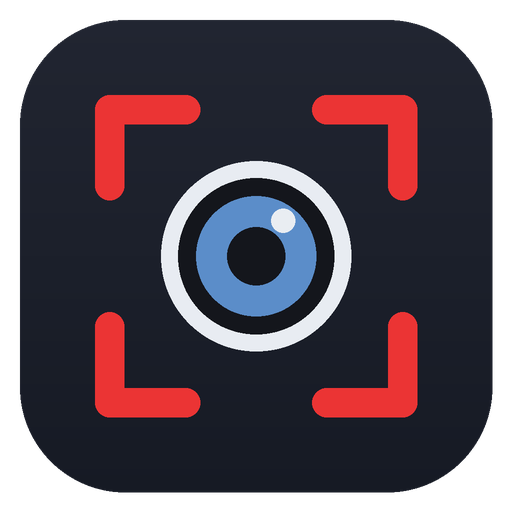
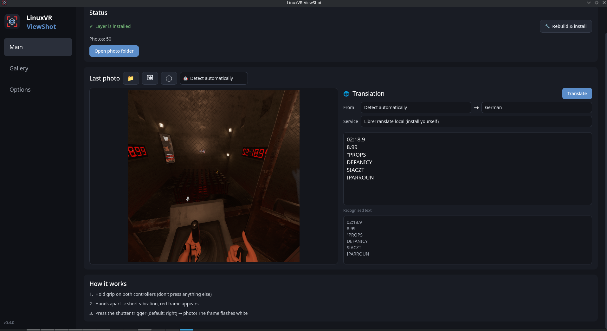
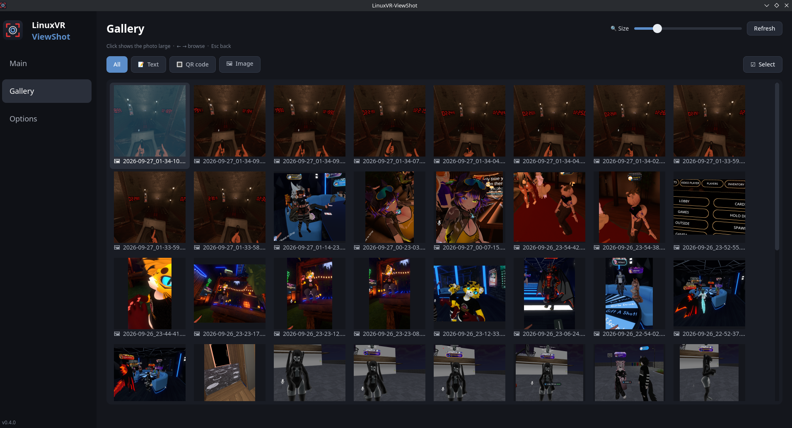
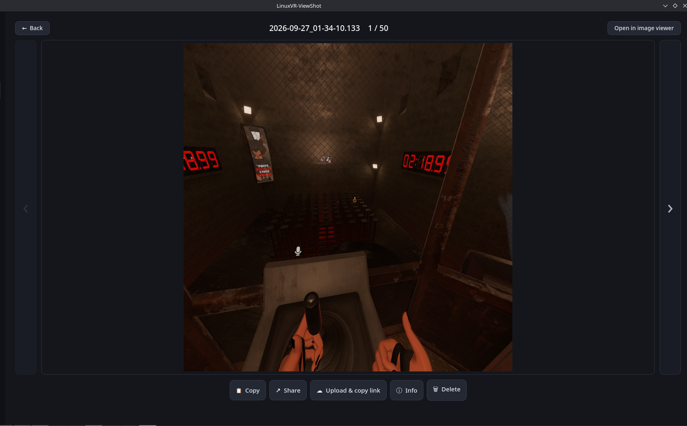
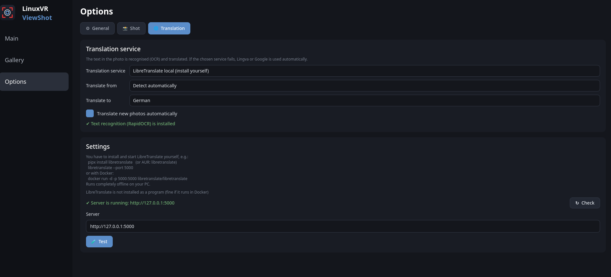
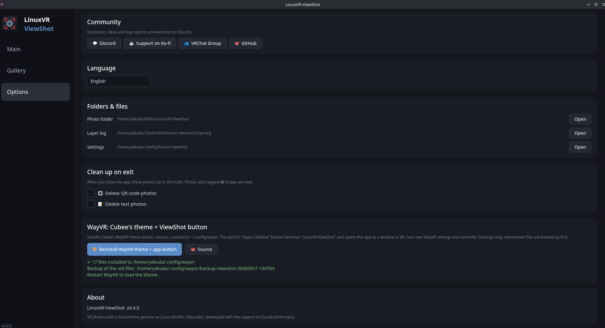

<p align="center">
  
</p>

<h1 align="center">LinuxVR-ViewShot</h1>

<p align="center">
  <b>Take photos in VR with a hand-frame gesture – on Linux (WiVRn / Monado).</b><br>
  A Linux alternative to VRHandsFrame: an OpenXR API layer + a desktop app for your photos.
</p>

<p align="center">
  <a href="LICENSE"></a>
  
  
  <a href="https://github.com/yakuda-stack/LinuxVR-ViewShot/releases"></a>
  <a href="https://discord.gg/ShNKvvZu74"></a>
</p>

<p align="center"><a href="#-english">🇬🇧 English</a> · <a href="#-deutsch">🇩🇪 Deutsch</a> · <a href="#-screenshots">📷 Screenshots</a></p>

<p align="center">
  
</p>

---

## 🇬🇧 English

### ⚡ Install
**Arch / CachyOS / EndeavourOS (AUR) – recommended:**
```bash
yay -S linuxvr-viewshot
```
Open **LinuxVR-ViewShot** once – the welcome window installs the VR layer + background service for you. Updates: `yay -Syu`.

**Other distros – script** (no sudo, everything goes into your home folder):
```bash
curl -fsSL https://raw.githubusercontent.com/yakuda-stack/LinuxVR-ViewShot/main/install.sh | bash
```
- Checks the dependencies and prints the install command for your distro if something is missing
- Builds the OpenXR layer, adds **LinuxVR-ViewShot** to your app menu and the command `linuxvr-viewshot`
- **Update:** run the same line again

**AppImage** (any distro, no Rust needed): download it from [Releases](https://github.com/yakuda-stack/LinuxVR-ViewShot/releases), `chmod +x`, start it and press **Install**

**Script needs:** `git`, `python3` + **PyQt6**, **rust/cargo 1.88 or newer** – Arch: `sudo pacman -S --needed git python-pyqt6 rust` (Debian/Ubuntu/Mint ship an older Rust → use [rustup](https://rustup.rs) or the AppImage)
**Optional:** text recognition for the translation – `pip install --user rapidocr onnxruntime`

After installing, **restart your VR game** so the layer gets loaded.

<details><summary>Uninstall · install from a clone</summary>

```bash
# uninstall (photos + settings stay)
curl -fsSL https://raw.githubusercontent.com/yakuda-stack/LinuxVR-ViewShot/main/install.sh | bash -s -- uninstall

# install from a clone
git clone https://github.com/yakuda-stack/LinuxVR-ViewShot.git
cd LinuxVR-ViewShot && ./install.sh          # ./install.sh uninstall
```
</details>

### 🙌 How it works
1. Hold **grip on both controllers** – don't touch trigger, A/B/X/Y or thumbstick
2. Hands at least ~15 cm apart for 0.4 s → short vibration, **red frame** appears
3. Press the **shutter trigger** (default: right) → **photo!** The frame flashes white
4. The area between your hands lands as PNG in `~/Pictures/LinuxVR-ViewShot/`
5. **The desktop app doesn't have to be open:** a small background service (Rust) starts with the VR game and translates, draws the 🪟 panel and runs 🔁 Lens – the app is for settings and for looking at what you did (gallery, history)

### ✨ Features

**In VR**

- 📸 Photo of the area **between** your hands – fingers stay outside, like a camera frame
- 👀 Frame matches what you see with both eyes; the red frame is never in the photo
- 🎮 Shutter on left / right / both triggers
- 📐 **Fixed aspect ratio** (free / 1:1 / 16:9) like a real camera – the frame keeps the format (Options → Shot)
- 🎞 **GIF:** hold the shutter → GIF (up to 15 s, frame blinks red/white), let go to stop; a short press stays a photo
- 🪟 **Translation panel in VR:** a window with the photo and numbers ①②③ on the text lines, the translations 1, 2, 3 below (long text: ▼ / ▲ pages) – service (+ mode 🤖 automatic / ✋ manual), task and languages by laser (point + trigger, round laser dot). **⚙** slides the settings down from the top like on a phone: size, opacity, attach to left/right hand, head or world, ✥ move (grip; glowing corner + trigger = width / height), ⟲ reset position, detection & buttons
- 🖼 **Pages + gallery in the VR panel:** at the bottom **◀** left / **▶** right switch between 🌐 translation and 🖼 gallery, **⚙** stays at the top. Each page keeps its **own size** in VR (gallery bigger by default). Gallery fills the whole panel: thumbnails with **month dividers** (“── 2026 October ──”), ▲ / ▼ pages; tap one → large with **📋 Copy · ☁ Upload + link · ↗ Share · 🌐 Translate · ⓘ Info · 🗑 Delete** (tap twice) and ‹ ›
- 🔘 **Button to open/close the panel** (like WayVR): sits on the same anchor as the panel (default: on top of the hand), laser + trigger = open/closed. In edit mode move, rotate and resize the button and the panel separately (e.g. next to the WayVR wrist menu) – the anchor (hand/head/world) stays the same; panel default = above the button. Colour pickable, **opens by itself after a photo** (on by default)
- 🥽 **🔁 Lens: translation over the original** (optional): a grey box with the translation exactly over every recognised line inside the blue frame (long text gets a smaller font instead of a bigger box) – photos are shown in the 🪟 panel
- 🔁 **Lens** (live translation): switch the frame icon to 🔁 with the type trigger, then press the shutter – instead of a photo the area is translated again every 1–10 s (blue frame); open a new frame to stop
- 🔀 **Type trigger** (default: left) switches the icon in the frame corner (corner selectable): automatic 🪄 Auto ↔ 🔁 Lens · ✋ manual 🖼 → 📝 → 🔳 → 🔁 Lens – the photo is tagged with the type
- ⚙️ Frame size and eye change **live**, even while the game is running
- Works with OpenXR games and OpenVR games via xrizer / OpenComposite · Quest/Touch, Pico, Index, Vive, WMR

**Desktop app**

- 🏠 **Main:** newest photo, status in one row (📁 photo folder · 🔧 rebuild · 🗑 remove layer), pick another photo with 📁 / 🖼
- 🌐 **Translation:** text in the photo is recognised (RapidOCR) and translated – Lingva, Google, LibreTranslate (local/Docker on port 5000 is found automatically), DeepL or your own API; *From → To* and *Service* right next to the photo – the dropdown only lists services that are set up – or only your ⭐ **favourites** (Options → Translation)
- 🤖 **AI translation:** Claude Code (Opus / Sonnet / Haiku), Gemini CLI, ChatGPT (Codex CLI) with your own login – or any command (e.g. `ollama run … {prompt}`). **Install** and **Sign in** buttons (npm, no sudo), model choice right next to *Service*; if the AI fails, Lingva/Google step in once (your service stays set) · the answer shows up **live while the AI is still writing** · ☁/🔒 note whether the text leaves your PC (only text, never the photo)
- 🖼 **Local image LLM (Ollama):** gets the photo too – reads tilted/small text, fixes OCR mistakes, finds text OCR missed; runs on your PC – **📦 Install Ollama** button picks the right package for your graphics card (Arch: `ollama-cuda` / `ollama-rocm`, other distros: official script), model is unloaded after 30 s–10 min so VR gets the graphics memory back
- 🧠 **AI task** next to it: translate · explain context · answer a question in the photo (quiz, riddle …)
- 🧭 **Service per task** (Options → Translation): **Mode** 🤖 automatic / ✋ manual · **Main** (e.g. local image LLM or LibreTranslate) · *Explain context* and *Answer question* each with their own AI (model = the one set for it) · 🤖 **Automatic** (only with an AI as main): for every photo the main AI decides – normal text it translates itself, jokes/memes → explain AI, quizzes → answer AI; if it guesses wrong, pick the task on the main page / in the VR panel – counts for the current + next photo, then automatic again · ✋ **Manual**: you pick the task, each task always uses its AI · nothing switches by itself · the local image LLM thinks first on quizzes (💡 proverb/hint), then ➜ number
- 🏷 **Last AI** under *Task* (main page + VR panel): which AI (and model/task) wrote the answer shown – stays until the next answer
- ⚙ **Without the app** (Options → General): background service `viewshot-daemon` (Rust, same OCR models, same services, same cache) – starts with every VR game or only with selected ones (systemd socket, woken by the layer), quits when the game ends; while the app is open it steps aside and the app does everything as before
- 📋 **Copy** button right above the translation · *Recognised text* folds away (▸, folded by default)
- 📤 **Output** (Options → General, each on/off): 📡 **OSC** – every new translation as `/viewshot/translation` (translation, original, source) to e.g. `127.0.0.1:9025`, so an OSC-DreamChatbox plugin can put it into the chatbox · 📄 **file** `translation.json` with the same info (+ `id` that changes with every translation, `time`) – also from the background service
- ↻ **Send again** (fresh answer); stuck AI requests are re-sent automatically (optional, per AI)
- 🕘 **History** (optional): past translations, tap to show them again, ⧉ opens it in its own window · ✏ fix the **recognised text** yourself and translate it again
- ⧉ **Pop out** the translation into its own window (in VR: its own panel)
- 🔳 **QR codes** in a photo appear as **clickable links** right in the translation (📋 copy)
- 🖼 **Gallery:** equal tiles with size slider, large view with ‹ ›, **Copy · Share · Upload & copy link** ([directupload.eu](https://www.directupload.eu/), incl. delete link) **· Info · Delete** (trash)
- 📁 **Gallery folders** (⚙ in the gallery): photo folder + more folders (e.g. `~/Pictures/VRChat`), each with *include subfolders* – desktop and VR gallery, month dividers. Only ViewShot photos are translated
- 🏷️ **Image detection:** every photo gets 📝 text / 🔳 QR / 🖼 image – VRChat nameplates don't count as text; filter the gallery, change tags in *Info*
- ☑ **Bulk select:** tap tiles → delete them all or set their type
- 🧹 **Clean up on exit** (optional): QR / text photos go to the trash when you close the app
- 🥽 Made for the VR laser: big buttons, wide sidebar, the mouse wheel never changes dropdowns by accident · EN / DE

### 💡 Tips
- Turn it off for one game: `DISABLE_LINUXVR_VIEWSHOT=1 %command%`
- Excluded apps (default `wayvr`): Options → Shot → *Exceptions*
- Log file: `~/.local/state/linuxvr-viewshot/layer.log` · settings: `~/.config/linuxvr-viewshot/`

### ⚠️ Limits
- The VR layer always lives in `~/.local` – Steam/Proton games (VRChat) run in Steam's container and can't see a layer in `/usr`
- Vulkan games only, 8-bit colour formats (RGBA8 / BGRA8)
- The trigger press also reaches the game

---

## 🇩🇪 Deutsch

### ⚡ Installation
**Arch / CachyOS / EndeavourOS (AUR) – empfohlen:**
```bash
yay -S linuxvr-viewshot
```
**LinuxVR-ViewShot** einmal öffnen – das Willkommen-Fenster installiert VR-Layer + Hintergrund-Dienst für dich. Updates: `yay -Syu`.

**Andere Distros – Skript** (kein sudo, alles landet in deinem Home-Ordner):
```bash
curl -fsSL https://raw.githubusercontent.com/yakuda-stack/LinuxVR-ViewShot/main/install.sh | bash
```
- Prüft die Abhängigkeiten und zeigt den Installationsbefehl für deine Distro, falls etwas fehlt
- Baut den OpenXR-Layer, legt **LinuxVR-ViewShot** ins Startmenü und den Befehl `linuxvr-viewshot` an
- **Update:** dieselbe Zeile nochmal ausführen

**AppImage** (jede Distro, ohne Rust): unter [Releases](https://github.com/yakuda-stack/LinuxVR-ViewShot/releases) laden, `chmod +x`, starten und **Installieren** drücken

**Das Skript braucht:** `git`, `python3` + **PyQt6**, **rust/cargo ab 1.88** – Arch: `sudo pacman -S --needed git python-pyqt6 rust` (Debian/Ubuntu/Mint haben ein älteres Rust → [rustup](https://rustup.rs) oder das AppImage nehmen)
**Optional:** Texterkennung für die Übersetzung – `pip install --user rapidocr onnxruntime`

Nach der Installation das **VR-Spiel neu starten**, damit der Layer geladen wird.

<details><summary>Entfernen · aus einem Klon installieren</summary>

```bash
# entfernen (Fotos + Einstellungen bleiben)
curl -fsSL https://raw.githubusercontent.com/yakuda-stack/LinuxVR-ViewShot/main/install.sh | bash -s -- uninstall

# aus einem Klon installieren
git clone https://github.com/yakuda-stack/LinuxVR-ViewShot.git
cd LinuxVR-ViewShot && ./install.sh          # ./install.sh uninstall
```
</details>

### 🙌 So funktioniert's
1. **Grip an beiden Controllern** halten – Trigger, A/B/X/Y und Stick nicht anfassen
2. Hände mind. ~15 cm auseinander, 0,4 s halten → kurzes Vibrieren, **roter Rahmen** erscheint
3. **Auslöser-Trigger** drücken (Standard: rechts) → **Foto!** Der Rahmen blitzt weiß
4. Der Bereich zwischen den Händen landet als PNG in `~/Bilder/LinuxVR-ViewShot/`
5. **Die Desktop-App muss nicht offen sein:** ein kleiner Hintergrund-Dienst (Rust) startet mit dem VR-Spiel und übersetzt, malt das 🪟 Panel und macht 🔁 Lens – die App ist zum Einstellen und zum Ansehen (Galerie, Verlauf)

### ✨ Funktionen

**In VR**

- 📸 Foto vom Bereich **zwischen** den Händen – Finger bleiben draußen, wie bei einem Kamera-Rahmen
- 👀 Ausschnitt passt zu dem, was du mit beiden Augen siehst; der rote Rahmen ist nie im Foto
- 🎮 Auslöser auf linkem / rechtem / beiden Triggern
- 📐 **Festes Seitenverhältnis** (frei / 1:1 / 16:9) wie bei einer echten Kamera – der Rahmen hält das Format (Optionen → Shot)
- 🎞 **GIF:** Auslöser gedrückt halten → GIF (bis 15 s, Rahmen blinkt rot/weiß), loslassen beendet; kurz drücken bleibt ein Foto
- 🪟 **Übersetzungs-Panel in VR:** Fenster mit dem Foto und Nummern ①②③ auf den Textzeilen, darunter die Übersetzungen 1, 2, 3 (langer Text: ▼ / ▲ blättern) – Dienst (+ Modus 🤖 Automatisch / ✋ Manuell), Aufgabe und Sprachen per Laser (zeigen + Trigger, runder Laser-Punkt). **⚙** klappt die Einstellungen wie beim Handy von oben herunter: Größe, Deckkraft, Hängt an linker/rechter Hand, Kopf oder Welt, ✥ Verschieben (Grip; leuchtende Ecke + Trigger = Breite / Höhe), ⟲ Position zurücksetzen, Erkennung & Tasten
- 🖼 **Seiten + Galerie im VR-Panel:** unten **◀** links / **▶** rechts wechseln zwischen 🌐 Übersetzung und 🖼 Galerie, **⚙** bleibt oben. Jede Seite hat ihre **eigene Größe** in VR (Galerie standardmäßig größer). Die Galerie nutzt das ganze Panel: Vorschaubilder mit **Monats-Trennern** („── 2026 Oktober ──“), ▲ / ▼ blättern; Antippen → groß mit **📋 Kopieren · ☁ Hochladen + Link · ↗ Teilen · 🌐 Übersetzen · ⓘ Info · 🗑 Löschen** (zweimal tippen) und ‹ ›
- 🔘 **Knopf zum Auf-/Zuklappen** (wie bei WayVR): hängt am selben Anker wie das Panel (Standard: oben auf der Hand), Laser + Trigger = auf/zu. Im Bearbeiten-Modus Knopf und Panel einzeln verschieben, drehen und vergrößern (z. B. neben das WayVR-Handgelenk-Menü) – der Anker (Hand/Kopf/Welt) bleibt gleich; Panel standardmäßig über dem Knopf. Farbe wählbar, **geht nach einem Foto von selbst auf** (Standard an)
- 🥽 **🔁 Lens: Übersetzung über dem Original** (optional): graues Kästchen mit Übersetzung genau über jeder erkannten Zeile im blauen Rahmen (zu langer Text → kleinere Schrift statt größeres Kästchen) – Fotos stehen im 🪟 Panel
- 🔁 **Lens** (Live-Übersetzung): Rahmen-Symbol mit dem Typ-Trigger auf 🔁 stellen, dann Auslöser – statt eines Fotos wird der Bereich alle 1–10 s neu übersetzt (blauer Rahmen); neuen Rahmen aufziehen beendet es
- 🔀 **Typ-Trigger** (Standard: links) schaltet das Symbol in der Rahmen-Ecke um (Ecke wählbar): automatisch 🪄 Auto ↔ 🔁 Lens · ✋ manuell 🖼 → 📝 → 🔳 → 🔁 Lens – das Foto wird mit dem Typ getaggt
- ⚙️ Rahmengröße und Auge ändern sich **live**, auch während das Spiel läuft
- Läuft mit OpenXR-Spielen und OpenVR-Spielen über xrizer / OpenComposite · Quest/Touch, Pico, Index, Vive, WMR

**Desktop-App**

- 🏠 **Main:** neuestes Foto, Status in einer Zeile (📁 Foto-Ordner · 🔧 Neu bauen mit %-Anzeige · 🗑 Layer entfernen), anderes Foto über 📁 / 🖼 wählen
- 🌐 **Übersetzung:** Text im Foto wird erkannt (RapidOCR) und übersetzt – Lingva, Google, LibreTranslate (lokal/Docker auf Port 5000 wird automatisch gefunden), DeepL oder eigene API; *Von → Nach* und *Dienst* direkt neben dem Foto – im Dropdown stehen nur eingerichtete Dienste – oder nur deine ⭐ **Favoriten** (Optionen → Übersetzung)
- 🤖 **KI-Übersetzung:** Claude Code (Opus / Sonnet / Haiku), Gemini CLI, ChatGPT (Codex CLI) mit deinem Login – oder ein beliebiger Befehl (z. B. `ollama run … {prompt}`). Knöpfe **Installieren** und **Anmelden** (npm, ohne sudo), Modell direkt neben *Dienst*; geht die KI nicht, springt einmal Lingva/Google ein (dein Dienst bleibt eingestellt) · die Antwort erscheint **schon, während die KI noch schreibt** · ☁/🔒 Hinweis, ob der Text deinen PC verlässt (nur Text, nie das Foto)
- 🖼 **Lokales Bild-LLM (Ollama):** bekommt das Foto mit – liest schräge/kleine Schrift, bessert OCR-Fehler aus, findet übersehenen Text; läuft auf deinem PC – Knopf **📦 Ollama installieren** nimmt das passende Paket für deine Grafikkarte (Arch: `ollama-cuda` / `ollama-rocm`, andere Distros: offizielles Skript), Modell wird nach 30 s–10 min entladen, damit VR den Grafikspeicher zurückbekommt
- 🧠 **KI-Aufgabe** daneben: übersetzen · Kontext erklären · Frage im Foto beantworten (Quiz, Rätsel …)
- 🧭 **Dienst je Aufgabe** (Optionen → Übersetzung): **Modus** 🤖 Automatisch / ✋ Manuell · **Main** (z. B. lokales Bild-LLM oder LibreTranslate) · *Kontext erklären* und *Frage beantworten* je mit eigener KI (Modell = das bei ihr eingestellte) · 🤖 **Automatisch** (nur mit KI als Main): bei jedem Foto entscheidet die Main-KI – normalen Text übersetzt sie selbst, Witze/Memes → Kontext-KI, Quiz → Frage-KI; liegt sie daneben, Aufgabe auf der Main-Seite / im VR-Panel umstellen – gilt fürs aktuelle + nächste Foto, dann wieder automatisch · ✋ **Manuell**: Aufgabe selbst wählen, jede Aufgabe nimmt fest ihre KI · nichts stellt sich von selbst um · das lokale Bild-LLM denkt bei Quiz erst nach (💡 Sprichwort/Hinweis), dann ➜ Nummer
- 🏷 **Letzte KI** unter *Aufgabe* (Main-Seite + VR-Panel): welche KI (mit Modell/Aufgabe) die angezeigte Antwort geschrieben hat – bleibt bis zur nächsten Antwort
- ⚙ **Ohne App** (Optionen → General): Hintergrund-Dienst `viewshot-daemon` (Rust, gleiche OCR-Modelle, gleiche Dienste, gleicher Cache) – startet bei jedem VR-Spiel oder nur bei ausgewählten (systemd-Socket, der Layer weckt ihn), beendet sich nach dem Spiel; ist die App offen, hält er sich raus und die App macht alles wie gewohnt
- 📋 **Kopieren**-Knopf direkt über der Übersetzung · *Erkannter Text* einklappbar (▸, standardmäßig zu)
- 📤 **Ausgabe** (Optionen → General, je an/aus): 📡 **OSC** – jede neue Übersetzung als `/viewshot/translation` (Übersetzung, Original, Quelle) z. B. an `127.0.0.1:9025`, damit ein OSC-DreamChatbox-Plugin sie in die Chatbox schreiben kann · 📄 **Datei** `translation.json` mit denselben Infos (+ `id`, die sich bei jeder Übersetzung ändert, `time`) – klappt auch über den Hintergrund-Dienst
- ↻ **Nochmal senden** (neue Antwort); hängt die KI, wird automatisch neu gesendet (optional, je KI)
- 🕘 **Verlauf** (optional): frühere Übersetzungen, antippen zeigt sie wieder, ⧉ öffnet ihn in einem eigenen Fenster · ✏ **erkannten Text** selbst korrigieren und neu übersetzen
- ⧉ Übersetzung in ein **eigenes Fenster** ausklinken (in VR: eigenes Panel)
- 🔳 **QR-Codes** im Foto stehen als **anklickbare Links** direkt in der Übersetzung (📋 kopieren)
- 🖼 **Galerie:** gleich große Kacheln mit Größen-Slider, große Ansicht mit ‹ ›, **Kopieren · Teilen · Hochladen & Link kopieren** ([directupload.eu](https://www.directupload.eu/), inkl. Lösch-Link) **· Info · Löschen** (Papierkorb)
- 📁 **Galerie-Ordner** (⚙ in der Galerie): Foto-Ordner + weitere Ordner (z. B. `~/Bilder/VRChat`), je mit *Unterordner einbeziehen* – Desktop- und VR-Galerie, Monats-Trenner. Übersetzt wird nur, was ViewShot fotografiert
- 🏷️ **Bild-Erkennung:** jedes Foto bekommt 📝 Text / 🔳 QR / 🖼 Bild – VRChat-Namensschilder zählen nicht als Text; Galerie danach filtern, Tags unter *Info* ändern
- ☑ **Mehrfach-Auswahl:** Kacheln antippen → alle löschen oder ihren Typ setzen
- 🧹 **Beim Beenden aufräumen** (optional): QR- / Text-Fotos kommen beim Schließen in den Papierkorb
- 🥽 Für den VR-Laser gemacht: große Knöpfe, breite Seitenleiste, das Mausrad verstellt keine Dropdowns aus Versehen · EN / DE

### 💡 Tipps
- Für ein Spiel abschalten: `DISABLE_LINUXVR_VIEWSHOT=1 %command%`
- Ausgenommene Programme (Standard `wayvr`): Optionen → Shot → *Ausnahmen*
- Log-Datei: `~/.local/state/linuxvr-viewshot/layer.log` · Einstellungen: `~/.config/linuxvr-viewshot/`

### ⚠️ Grenzen
- Der VR-Layer liegt immer in `~/.local` – Steam-/Proton-Spiele (VRChat) laufen im Steam-Container und sehen einen Layer in `/usr` nicht
- Nur Vulkan-Spiele, 8-Bit-Farbformate (RGBA8 / BGRA8)
- Der Trigger-Druck kommt auch im Spiel an

---

## 📷 Screenshots

<table>
  <tr>
    <td width="50%"></td>
    <td width="50%"></td>
  </tr>
  <tr>
    <td align="center"><b>Gallery / Galerie</b> – filter 📝 🔳 🖼, size slider, bulk select</td>
    <td align="center"><b>Large view / Große Ansicht</b> – copy, share, upload, info, delete</td>
  </tr>
  <tr>
    <td width="50%"></td>
    <td width="50%"></td>
  </tr>
  <tr>
    <td align="center"><b>Translation / Übersetzung</b> – LibreTranslate, DeepL, Google, Lingva, own API</td>
    <td align="center"><b>Shot</b> – frame size, eye, triggers, manual mode</td>
  </tr>
  <tr>
    <td colspan="2"></td>
  </tr>
  <tr>
    <td colspan="2" align="center"><b>General</b> – language, folders, clean up on exit, OSC / text file output, background service</td>
  </tr>
</table>

---

## 🗂️ Project layout / Aufbau
```
install.sh        curl | bash installer (install / update / uninstall)
layer/            OpenXR API layer (Rust)
  src/lib.rs        OpenXR hooks (entry point)
  src/gesture.rs    gesture + trigger state machine (tested)
  src/frame.rs      hands → image rectangle, frame + icon quads (tested)
  src/capture.rs    Vulkan copy GPU ↔ RAM
  src/save.rs       pixel conversion + PNG (with photo type)
  src/overlay.rs    🥽 loads images from the UI (overlay/overlay.png, panel/panel.png)
  src/panel.rs      🪟 panel: pose math, laser hit, click/move/resize (tested)
  src/icons.rs      manual photo type + frame icons
  src/config.rs     layer.json (reloaded live)
  assets/           frame icons (image / text / QR)
daemon/           ⚙ background service viewshot-daemon (Rust) – translates + draws the panel without the app
  src/ocr.rs        text recognition: RapidOCR's PaddleOCR models via onnxruntime (same results)
  src/tr/           translators, AI CLIs, Ollama, auto/manual routing, translations.json cache
  src/panel.rs      🪟 panel drawn in Rust (tiny-skia + cosmic-text), clicks via UDP
  src/app.rs        main loop: new photo / Lens → OCR → translate; steps aside while the app is open
  contract.json     texts, defaults, cache keys, prompts from the app (scripts/make_daemon_contract.py)
UI/               desktop app (PyQt6)
  start.sh          start (sets the process name, see starter.py)
  core/             paths, config, EN/DE/FR texts, OCR, translation, tags, output (OSC / file),
                    overlay.py (draws the VR translation image), vision.py (Ollama image LLM)
  ui/vr_panel.py    🪟 invisible Qt window → panel.png, clicks from VR via UDP
  ui/               window, style, pages (main / gallery / options)
  ui/pages/main_*.py  Main page parts: translation, history, install, Lens
manifest/         OpenXR layer manifest template
packaging/        .desktop template, aur/PKGBUILD (+ README-AUR.md)
scripts/          install-layer.sh, build_appimage.sh, bump_version.py, make_daemon_contract.py
tests/            pytest + smoke test (python3 -m pytest -q, python3 tests/smoke.py)
.github/workflows/ runs cargo test + clippy + pytest + smoke test on every push
assets/           README screenshots
```

## 🙏 Credits
- Inspired by **VRHandsFrame**
- Translators shared with [**OSC-DreamChatbox**](https://github.com/yakuda-stack/OSC-DreamChatbox)
- Text recognition: [RapidOCR](https://github.com/RapidAI/RapidOCR) · Image hosting: [directupload.eu](https://www.directupload.eu/)

## 📄 License
[GPL-3.0](LICENSE) © Yakuda

> 🤖 **Transparency Note:** This project is developed with the support of AI coding assistants (**Claude by Anthropic**).
